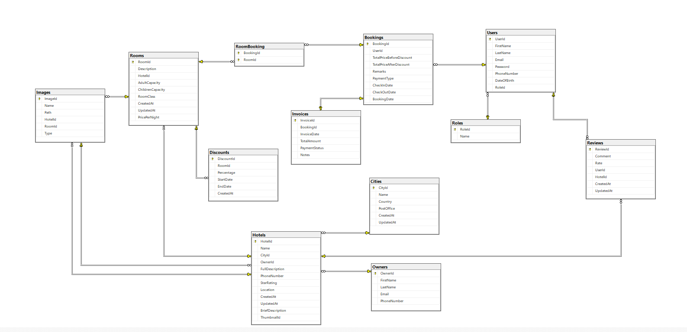

# 🧳 Travel and Accommodation Booking Platform

## 📌 Overview

The **Travel and Accommodation Booking Platform** is a robust, full-featured web application built to replicate a real-world hotel booking system. Developed during a professional training program, it follows **Clean Architecture principles**, ensuring modularity, scalability, and maintainability.

This platform allows users to seamlessly search, book, and review hotels, while giving admins full control over hotels, rooms, cities, and operations.

### ✨ Core Highlights

- User authentication  
- Hotel browsing & search  
- Booking management  
- Admin hotel control  
- Ratings & reviews  
- PDF invoice generation 
- Email notifications - with PDF booking details  

---

## ⚙️ Tech Stack

| Layer             | Technology                     |
|----------------------|--------------------------------|
| Backend              | ASP.NET Core 9 (Web API)       |
| ORM                  | Entity Framework Core 9        |
| Database             | SQL Server                     |
| Authentication       | JWT Bearer Tokens              |
| Validation           | FluentValidation               |
| Object Mapping       | AutoMapper                     |
| Logging              | Serilog (Console & File)       |
| Filtering/Pagination | Sieve                          |
| Email Service        | MailKit                        |
| PDF Reports          | NReco.PdfGenerator             |
| Testing              | xUnit, Moq                     |
| API Docs             | Swagger / OpenAPI              |

---

## 🧱 Architecture

This project follows **Clean Architecture**:

```
├── Core             --> Domain entities, interfaces, shared models.  
├── Application      --> DTOs, business rules, validators, services. 
├── Infrastructure   --> EF DbContext, data access, external services, configurations.
├── WebAPI           --> Presentation layer with REST controllers and API configuration.

```

---

## 🚀 Getting Started

### ✅ Prerequisites

- [.NET 9 SDK](https://dotnet.microsoft.com/en-us/download/dotnet/9.0)
- SQL Server
- Visual Studio 2022+ or CLI

### ▶️ Run the App


### 1️⃣ Clone the Repository

```bash
git clone https://github.com/marwa-abusaa/Travel-and-Accommodation-Booking-Platform.git
cd TravelAndAccommodationBookingPlatform
```

### 2️⃣ Set Up Connection String
Update your connection string in the environment variable:
> It's recommended to store sensitive data like JWT secrets and connection strings in environment variables for enhanced security.


```bash
var connectionString = Environment.GetEnvironmentVariable("TravelABP_DB_CONNECTION");
```


### 3️⃣ Apply Database Migrations

```bash
dotnet ef database update --project TravelAndAccommodationBookingPlatform.Infrastructure
```

### 4️⃣ Run the Application

```bash
cd TravelAndAccommodationBookingPlatform.WebAPI
dotnet run
```

### 5️⃣ Access Swagger UI
Open your browser and go to:
`https://localhost:<port>/swagger`

---

## 🧪 Running Tests

```bash
cd TravelAndAccommodationBookingPlatform.Tests
dotnet test
```

---

## 🔐 Authentication & Authorization

Uses **JWT Authentication**

**Roles**:

- **Admin**: Can manage owners, hotels, rooms and cities
- **User**: Can browse & book hotels  

> Admins assign hotel Owners through the dashboard

---

## 🛠 Features

- 🔒 Secure login & registration using JWT  
- 🏨 Hotel search by city, rating, and price  
- 📅 Booking available rooms across date ranges  
- 🛏️ Multi-room booking per reservation  
- 💳 Checkout with invoice & PDF generation  
- 📧 Email notifications using MailKit  
- ⭐ Reviews & hotel ratings  
- 🔧 Admin dashboard for hotel/room/city management  
- 🧪 Cleanly unit-tested services  
- 📜 Swagger-based API documentation
- 🎯 Filtering, Sorting, Paging using Sieve

---

## 🔗 API Endpoints

### Authentication

| Method | Endpoint         | Description           |
|--------|------------------|-----------------------|
| POST   | /api/auth/signup | Register a new user   |
| POST   | /api/auth/login  | Login and get JWT     |

### Bookings
[Authorize(Roles = UserRoles.User)]

| Method | Endpoint                  | Description             |
|--------|---------------------------|-------------------------|
| POST   | /api/bookings             | Create a new booking    |
| DELETE | /api/bookings/{id}        | Delete a booking by ID  |
| GET    | /api/bookings/{id}        | Get booking details by booking ID |

### Cities

| Method | Endpoint               | Description                                         |
|--------|------------------------|-----------------------------------------------------|
| POST   | /api/cities            | Add a new city (Admin only)                         |
| DELETE | /api/cities/{id}       | Delete a city by ID (Admin only)                    |
| PUT    | /api/cities/{id}       | Update a city by ID (Admin only)                    |
| GET    | /api/cities/{id}       | Get city details by ID (Public)                     |
| GET    | /api/cities/trending   | Get top N most visited cities (Public, default 5)  |
| GET    | /api/cities/search     | Search cities with filters, sorting & pagination (Admin only) |
| GET    | /api/cities/{cityId}/hotels | Get paginated hotels in a city (Public)          |

### Discounts

| Method | Endpoint                                      | Description                          |
|--------|-----------------------------------------------|--------------------------------------|
| GET    | /api/rooms/{roomId}/discounts/{discountId}    | Get a specific discount by ID (Public) |
| POST   | /api/rooms/{roomId}/discounts                 | Create a new discount for a room (Admin only)  |
| DELETE | /api/rooms/{roomId}/discounts/{discountId}    | Delete a discount by ID (Admin only)   |
| GET    | /api/rooms/{roomId}/discounts                 | Get all discounts for a specific room (Public) |

### Hotels

| Method | Endpoint                                         | Description                                      |
|--------|--------------------------------------------------|--------------------------------------------------|
| POST   | /api/hotels                                      | Create a new hotel (Admin only)                  |
| DELETE | /api/hotels/{id}                                 | Delete a hotel by ID (Admin only)                |
| PUT    | /api/hotels/{id}                                 | Update a hotel by ID (Admin only)                |
| GET    | /api/hotels/{hotelId}/owner                      | Get owner info of a hotel (Public)               |
| GET    | /api/hotels/featured-deals                       | Get featured hotel deals (Public)                |
| GET    | /api/hotels/{id}                                 | Get hotel details by ID  (Public)                |
| GET    | /api/hotels/search                               | Search hotels with filters (Public)            |
| GET    | /api/hotels/search-admin                         | Admin search for hotels (Admin only)             |
| GET    | /api/hotels/{hotelId}/rooms/available            | Get available rooms for a hotel (Public)         |
| POST   | /api/hotels/{hotelId}/images                     | Add image to hotel (Admin only)                  |
| PUT    | /api/hotels/{hotelId}/images/{imageId}           | Update hotel image by ID  (Admin only)           |
| DELETE | /api/hotels/{hotelId}/images/{imageId}           | Delete hotel image by ID (Admin only)            |
| GET    | /api/hotels/{hotelId}/images/{imageId}           | Get hotel image by ID (Admin only)               |

### Invoices
[Authorize(Roles = UserRoles.User)]
| Method | Endpoint                                       | Description                                |
|--------|------------------------------------------------|--------------------------------------------|
| GET    | /api/bookings/{bookingId}/invoices/{invoiceId} | Get invoice by ID                          |
| POST   | /api/bookings/{bookingId}/invoices             | Create a new invoice                       |
| GET    | /api/bookings/{bookingId}/invoices/{invoiceId}/print | Generate and download invoice as PDF |

### Owners
[Authorize(Roles = UserRoles.Admin)]
| Method | Endpoint                        | Description                             |
|--------|----------------------------------|-----------------------------------------|
| POST   | /api/owners                      | Create a new owner                      |
| PUT    | /api/owners/{id}                 | Update an existing owner                |
| GET    | /api/owners/{id}                 | Get a specific owner by ID              |
| GET    | /api/owners/{ownerId}/hotels     | Get all hotels owned by a specific owner |

### Reviews
[Authorize(Roles = UserRoles.User)]
| Method | Endpoint                                      | Description                               |
|--------|-----------------------------------------------|-------------------------------------------|
| GET    | /api/hotels/{hotelId}/reviews/{reviewId}      | Get a specific review by ID               |
| POST   | /api/hotels/{hotelId}/reviews                 | Create a new review for a specific hotel  |
| PUT    | /api/hotels/{hotelId}/reviews/{reviewId}      | Update a review for a specific hotel      |
| DELETE | /api/hotels/{hotelId}/reviews/{reviewId}      | Delete a review by ID                     |
| GET    | /api/hotels/{hotelId}/reviews                 | Get all reviews for a specific hotel (Public) |

### Rooms
[Authorize(Roles = UserRoles.Admin)]
| Method | Endpoint                                     | Description                                 |
|--------|----------------------------------------------|---------------------------------------------|
| GET    | /api/rooms/{id}                              | Get a room by ID (Public)                   |
| POST   | /api/rooms                                   | Create a new room                           |
| PUT    | /api/rooms/{id}                              | Update an existing room                     |
| DELETE | /api/rooms/{id}                              | Delete a room by ID                         |
| GET    | /api/rooms/search                            | Search rooms with filtering & pagination    |
| POST   | /api/rooms/{roomId}/images                   | Add an image to a specific room             |
| PUT    | /api/rooms/{roomId}/images/{imageId}         | Update a room's image                       |
| DELETE | /api/rooms/{roomId}/images/{imageId}         | Delete a room's image                       |
| GET    | /api/rooms/{roomId}/images/{imageId}         | Get an image by its ID                      |

### UserDashboard
[Authorize(Roles = UserRoles.User)]
| Method | Endpoint                          | Description                                              | 
|--------|-----------------------------------|----------------------------------------------------------|
| GET    | /api/user/dashboard/bookings      | Retrieves all bookings made by the authenticated user    |
| GET    | /api/user/dashboard/recent-hotels | Retrieves hotels recently visited by the authenticated user |
| GET    | /api/user/dashboard/invoices      | Retrieves all invoices of the authenticated user         |

---

## 🗃️ Database Schema
The following Entity-Relationship Diagram (ERD) shows the structure of the database and how entities are related.



---

## 👩‍💻 Author  
Developed by **Marwa AbuSaa**

Backend training by Footill Technology

---

## 📜 License  
This project is licensed under the MIT License.
